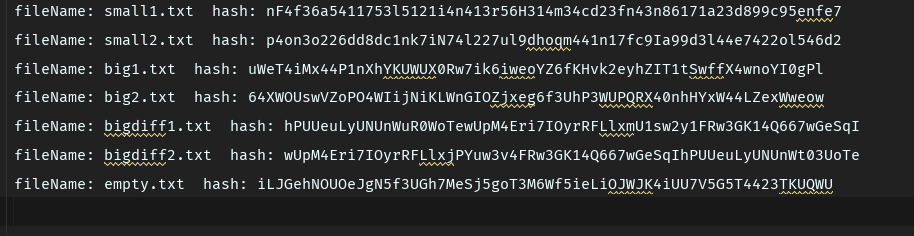
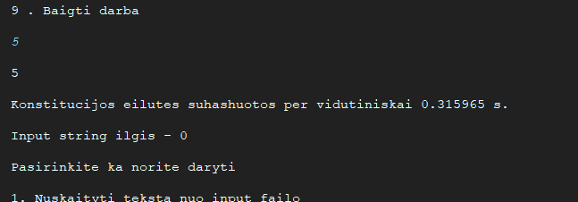
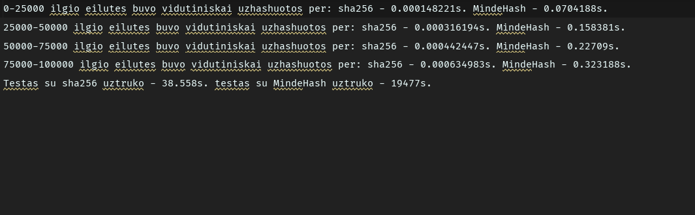
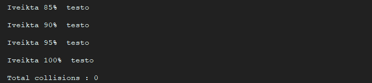

# Experimental research-analysis of MindeHash

This file contains the results of the analysis performed on [MindeHash](https://github.com/gitguuddd/Hash_generatorius) hashing class.
The requirements for the analysis can be found [here](https://github.com/blockchain-group/Blockchain-technologijos/blob/master/pratybos/1uzduotis-Hashavimas.md)

## Results of task no. 1

- files ```small1 and small2``` each contained a character , both characters were different
- files ```big1 and big2``` each contained a string made out of random characters with length of 10001 characters, both strings were different
- files ```bigdiff1 and bigdiff2``` each contained a string made out of random characters with length of 10002 characters, both strings differed in only 1 character
- file ```empty.txt``` contains nothing and is used to determine if the MindeHash will use the default value if no input is given

| Input file name | Generated hash                                                   |
|-----------------|------------------------------------------------------------------|
| small1.txt      | nF4f36a5411753l5121i4n413r56H314m34cd23fn43n86171a23d899c95enfe7 |
| small2.txt      | p4on3o226dd8dc1nk7iN74l227ul9dhoqm441n17fc9Ia99d3l44e7422ol546d2 |
| big1.txt        | uWeT4iMx44P1nXhYKUWUX0Rw7ik6iweoYZ6fKHvk2eyhZIT1tSwffX4wnoYI0gPl |
| big2.txt        | 64XWOUswVZoPO4WIijNiKLWnGIOZjxeg6f3UhP3WUPQRX40nhHYxW44LZexWweow |
| bigdiff1.txt    | hPUUeuLyUNUnWuR0WoTewUpM4Eri7IOyrRFLlxmU1sw2y1FRw3GK14Q667wGeSqI |
| bigdiff2.txt    | wUpM4Eri7IOyrRFLlxjPYuw3v4FRw3GK14Q667wGeSqIhPUUeuLyUNUnWt03UoTe |
| empty.txt       | iLJGehNOUOeJgN5f3UGh7MeSj5goT3M6Wf5ieLiOJWJK4iUU7V5G5T4423TKUQWU |

- By interpreting the results shown in the table we can clearly see that ```MindeHash```  satisfies the 1-3rd requirements of a Hash function
---
## Results of task no. 2


- On average it took about 0.315965 s. for ```MindeHash``` to hash a line in ```konstitucija.txt```
---
## Results of advanced comparison between SHA-256 and MindeHash


| Hash function | 1-25000 input length hash avg.  | 25000-50000 input length hash time avg. | 50000-75000 input length hash time avg. | 75000-100000 input length hash time avg. | Total test time |
|---------------|---------------------------------|-----------------------------------------|-----------------------------------------|------------------------------------------|-----------------|
| SHA256        | 0.000148221                     | 0.000316194                             | 0.000442447                             | 0.000634983                              | 38.558          |
| MindeHash     | 0.0704188                       | 0.158381                                | 0.22709                                 | 0.323188                                 | 19477           |
- The comparison was done by comparing the hashing of 100000 strings with lengths of 1 to 100000 (length increased with each iteration)
- By interpreting the results of the table we learn that:
- ```MindeHash``` is around ```475``` times slower than ```SHA256``` when hashing inputs with length 1-25000
- ```MindeHash``` is around ```500``` times slower than ```SHA256``` when hashing inputs with length 25000-50000
- ```MindeHash``` is around ```513``` times slower than ```SHA256``` when hashing inputs with length 50000-75000
- ```MindeHash``` is around ```509``` times slower than ```SHA256``` when hashing inputs with length 75000-100000
- In total ```MindeHash``` is around ```505``` times slower than ```SHA256```
- Conclusion - ```MindeHash``` is SLOW
---
## Results of task no. 3

- ```MindeHash``` produced no collisions during task 3 test and thus satisfied the 6th requirement of a hash function
---
## Results of task no. 4


| difference         | value    |
|--------------------|----------|
| Maximum difference | 47.4609% |
| Average difference | 36.7578% |
| Minimum difference | 0.78125% |
- By interpreting the results we learn that ```MindeHash``` is not well suited for generating drastic changes in output with only minimal changes in input and does not really satisfy the 7th requirement of a hash function
