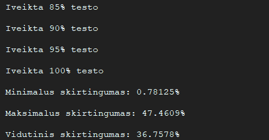

# Experimental research-analysis of MindeHash

This file contains the results of the analysis performed on [MindeHash](https://github.com/gitguuddd/Hash_generatorius) hashing class.
The requirements for the analysis can be found [here](https://github.com/blockchain-group/Blockchain-technologijos/blob/master/pratybos/1uzduotis-Hashavimas.md)

## Results of task no. 1

- files ```small1 and small2``` each contained a character , both characters were different
- files ```big1 and big2``` each contained a string made out of random characters with length of 10001 characters, both strings were different
- files ```bigdiff1 and bigdiff2``` each contained a string made out of random characters with length of 10002 characters, both strings differed in only 1 character

| Input file name | Generated hash                                                   |
|-----------------|------------------------------------------------------------------|
| small1.txt      | nF4f36a5411753l5121i4n413r56H314m34cd23fn43n86171a23d899c95enfe7 |
| small2.txt      | p4on3o226dd8dc1nk7iN74l227ul9dhoqm441n17fc9Ia99d3l44e7422ol546d2 |
| big1.txt        | uWeT4iMx44P1nXhYKUWUX0Rw7ik6iweoYZ6fKHvk2eyhZIT1tSwffX4wnoYI0gPl |
| big2.txt        | 64XWOUswVZoPO4WIijNiKLWnGIOZjxeg6f3UhP3WUPQRX40nhHYxW44LZexWweow |
| bigdiff1.txt    | hPUUeuLyUNUnWuR0WoTewUpM4Eri7IOyrRFLlxmU1sw2y1FRw3GK14Q667wGeSqI |
| bigdiff2.txt    | wUpM4Eri7IOyrRFLlxjPYuw3v4FRw3GK14Q667wGeSqIhPUUeuLyUNUnWt03UoTe |

- By interpreting the results shown in the table we can clearly see that ```MindeHash```  satisfies the 1-3rd requirements of a Hash function
---
## Results of task no. 2


- On average it took about 0.520789 s. for ```MindeHash``` to hash a line in ```konstitucija.txt```
---
## Results of advanced comparison between SHA-256 and MindeHash
Coming soon :)

- The comparison was done by comparing the hashing of 100000 strings with lengths of 1 to 100000 (length increased with each iteration)
---
## Results of task no. 3

- ```MindeHash``` produced no collisions during task 3 test and thus satisfied the 6th requirement of a hash function
---
## Results of task no. 4


| Similarity         | value    |
|--------------------|----------|
| Maximum similarity | 98.8281% |
| Average similarity | 63.2403% |
| Minimum similarity | 52.5391% |
- By interpreting the results we learn that ```MindeHash``` is not well suited for generating drastic changes in output with only minimal changes in input